# Camera+

Camera+ is a coursework-ready Expo Router app built with React Native that demonstrates real-time camera effects, photo editing, history tracking, and local authentication. The app bakes active effects into each capture, ensuring Album, History, and Viewer stay in sync even when Android/Expo Go limits file system access. Everything runs locally, making it simple to demo on-device without cloud services.

## Documentation
Gitlab Repo:  https://gitlab.uwe.ac.uk/an3-aboobakuru/mobiledev
Youtube link: https://www.youtube.com/watch?v=t9BUl6QXPNo
## Submission Documents inside docs/
- **User Testing Report**: `CameraPlus_UserTesting_Nabhan.docx`

## Prerequisites
- Node.js 18+
- Yarn 1.22+ (or npm)
- Expo CLI (`npm install -g expo-cli`)
- iOS Simulator/Xcode or Android Studio
- Expo Go app on your mobile device

## Quick install & run

```bash
# 1. Clone the repo
git clone https://gitlab.uwe.ac.uk/an3-aboobakuru/mobiledev.git
cd mobiledev

# 2. Install dependencies (choose ONE)
npm install
# or
yarn install

# 3. (Optional) Ensure Expo-managed packages are aligned
npx expo install

# 4. Start the development server
npx expo start
# or
yarn start
```


## Architecture
- **Framework**: Expo Router v6 with React Native 0.81.5
- **State Management**: MobX with mobx-persist-store for persistence
- **Storage**: AsyncStorage with safe wrapper to handle "Row too big" errors
- **Camera**: expo-camera v17 with real-time effect overlays
- **Image Processing**: react-native-view-shot for baking effects into images
- **Media Library**: expo-media-library for gallery access and export

Module	            Responsibility

src/app/_layout.tsx	Root layout with providers (MobX stores, SafeArea, StatusBar).
src/app/login.tsx	Login screen (email/password).
src/app/register.tsx	Registration screen for new accounts.
src/app/(app)/_layout.tsx	Protected tab layout (Album, Camera+, History, Settings, Details).
src/app/(app)/album.tsx	Album grid; merges device album and local recent captures.
src/app/(app)/camera-advanced.tsx	Main camera preview and capture workflow with live effects.
src/app/(app)/photo.tsx	Photo editor screen (baked preview and export).
src/app/(app)/history.tsx	Edit history screen with filter/sort and pagination.
src/app/(app)/settings.tsx	Settings screen (camera defaults + account section).
src/app/(app)/details.tsx	App information screen (version, description).
src/stores/auth-store.tsx	MobX store for authentication and user/session persistence.
src/stores/camera-store.ts	MobX store for camera preferences and recent captures.
src/stores/history-store.ts	MobX store for edit history (draft/exported entries).
src/stores/index.tsx	Store provider/entry point for MobX stores.
src/lib/camera-permissions.ts	Camera and media‑library permission helpers.
src/lib/tint.ts	Tint helpers and swatch definitions.
src/lib/date.ts	Date/time formatting helpers for history and details.
src/lib/fs.ts	File‑system utilities (delete local images, etc.).
src/lib/safe-storage.ts	AsyncStorage wrapper that suppresses “Row too big” errors.

## Camera+ Features

### Core Features
- **Real-time Camera Effects**: None, Night, Thermal, and Tint effects with adjustable strength
- **Baked Image Capture**: Effects are baked into images at capture time using offscreen compositing
- **Photo Editor**: Layer additional effects on top of baked images with live preview
- **History Tracking**: Automatic draft creation and export tracking with pagination (10 items per page)
- **Album Management**: Merges device gallery items with local captures
- **Local Authentication**: AsyncStorage-backed session persistence with email/password

### User Interface
- **Camera+ Screen**: White header bar with "Camera+" title, dark divider, and icon-based Front/Flash controls
- **Settings Screen**: Centralized camera defaults (look, tint, effect strengths) with auto-save
- **History Screen**: Filterable (All/Drafts/Exported) and sortable (Newest/Oldest) edit history
- **Viewer Screen**: Full-screen photo viewing with Edit, Export, and Delete actions
- **Photo Editor**: Real-time effect preview with strength sliders and export functionality

## Feature Walkthrough

1. **Authentication**: Sign in with email/password or register a new account. Sessions persist across app restarts.

2. **Settings Configuration**: 
   - Adjust default look (None/Night/Thermal/Tint) in Settings
   - Set default tint color from color swatches
   - Configure effect strengths (Tint/Night/Thermal) with sliders
   - Changes auto-save and show "Saved ✓" feedback
   - Defaults hydrate on app start and apply to Camera+

3. **Camera Capture**:
   - Select a look (None/Night/Thermal/Tint) in Camera+
   - Choose tint color if using Tint effect
   - Adjust effect strength using sliders in Settings
   - Toggle front/back camera and flash settings
   - Capture photo; effect is automatically baked into the image
   - Opens in Viewer screen after capture

4. **Album Navigation**:
   - Tap a photo in Album → opens Viewer
   - Long-press a photo → opens Photo Editor for manual edits
   - Pick from gallery → creates draft entry and opens Editor

5. **Photo Editor**:
   - Automatically creates draft entry in History
   - Apply effects (None/Night/Thermal/Tint) with strength adjustment
   - Layer effects on top of baked images from camera
   - Real-time preview with ViewShot compositing
   - Export to gallery saves image and marks draft as exported

6. **Viewer Actions**:
   - Back: Return to previous screen
   - Edit: Opens Photo Editor with current image
   - Export: Routes through Editor to capture final image with effects
   - Delete: Removes photo from app (if from local captures)

7. **History Management**:
   - View all edits, drafts only, or exported items
   - Sort by newest or oldest
   - Pagination: 10 items per page with Previous/Next controls
   - Resume: Continue editing a draft
   - Re-edit: Edit an exported item (creates new draft)
   - Export: Export a draft to gallery
   - Delete: Remove individual history entries
   - Clear: Remove all history entries

## Screenshots & Demo Clips

### 1. Opening App After Swiping It Away
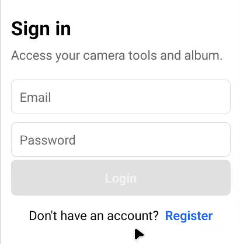
- Shows the app being reopened after it was swiped off from recent apps.
- Confirms that the splash / entry screen loads correctly.
- Demonstrates basic start-up behaviour on a real device.

### 2. Logging In
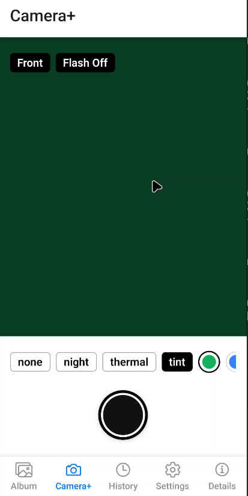
- Main login screen with email and password fields.
- User submits valid details to access the app.
- Demonstrates the primary authentication flow.

### 3. Duplicate Email Error
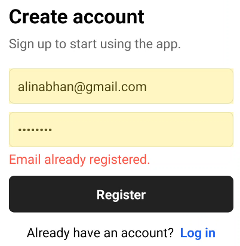
- Registration form with an email that already exists.
- App displays a clear “duplicate email” style validation message.
- Shows how server-side validation errors are surfaced to the user.

### 4. Invalid Email Error
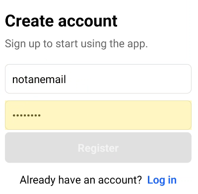
- Email field contains an invalid format.
- Client-side validation blocks submission.
- Helps illustrate input validation and user feedback.

### 5. Password Validation
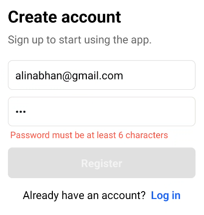
- Password field shows requirements (length / complexity).
- Invalid password triggers inline validation messaging.
- Demonstrates security-focused feedback for weak passwords.

### 6. Drafts / History – Part 1
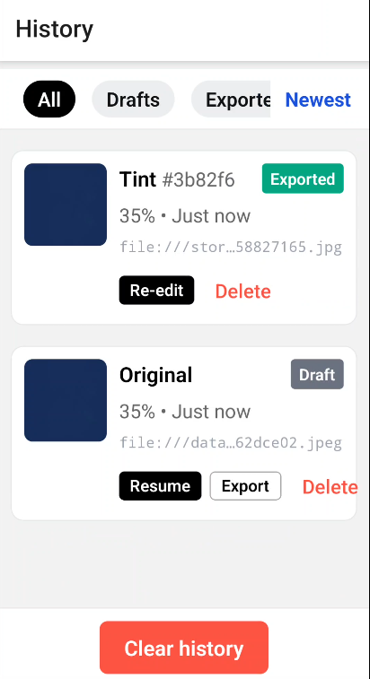
- First part of the history / drafts screen.
- Shows how saved items are listed for later reuse.
- Highlights the general layout of list entries.

### 7. Long-Press Delete
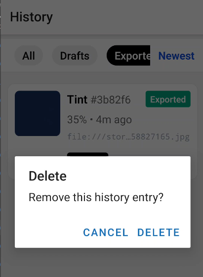
- User long-presses an entry in the list.
- A delete / remove option is shown.
- Demonstrates how users can manage and clean up saved data.

### 8. Settings Screen
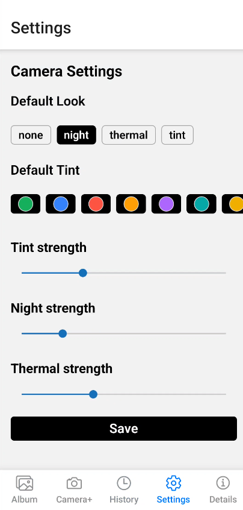
- Central place to manage app preferences.
- Contains options for account, permissions, or behaviour.
- Shows overall structure and design of the Settings page.

### 9. Details Screen
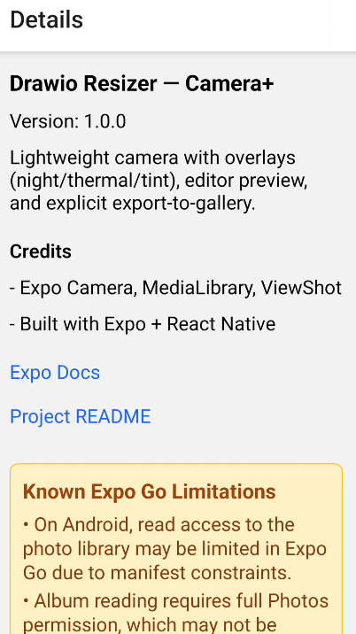
- Detailed view for a single history or export entry.
- Shows metadata such as date, status, or filename.
- Demonstrates drill-down navigation from lists.

### 10. Draft Filter
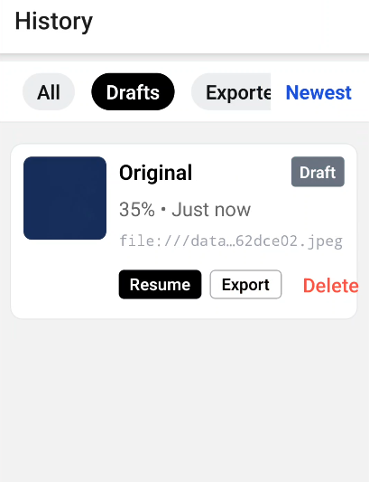
- User filters the list to only show draft items.
- Makes it easier to find in-progress work.
- Demonstrates basic filtering controls in the UI.

### 11. Resumed Draft
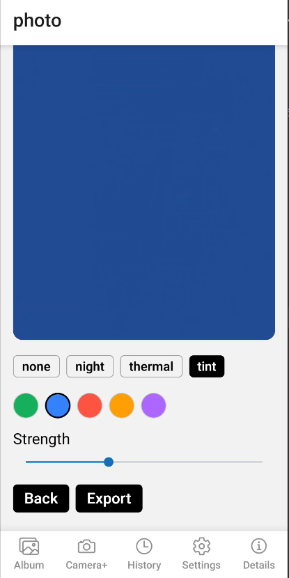
- A previously saved draft is reopened.
- User can continue editing from where they stopped.
- Shows persistence of work between sessions.

---

## Animated Flows & Videos

### 12. Signed-Out State
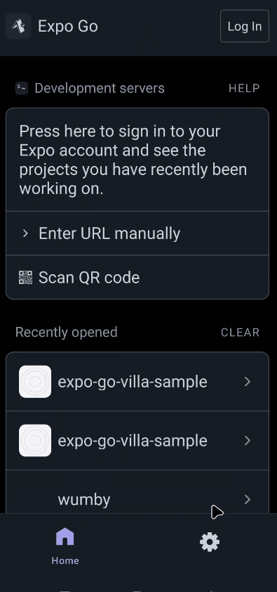
- Home screen for users who are not logged in.
- Prompts the user to sign in or register.
- Demonstrates the default state on app launch.

### 13. Login Flow
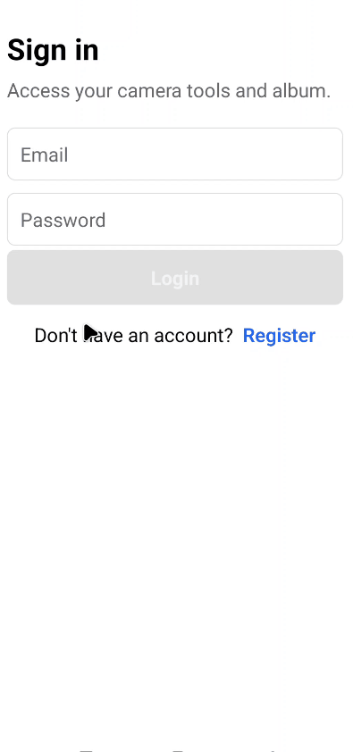
- Full login process from entering credentials to success.
- Shows loading / feedback while authenticating.
- Confirms that users are routed into the main app after login.

### 14. Session Persistence
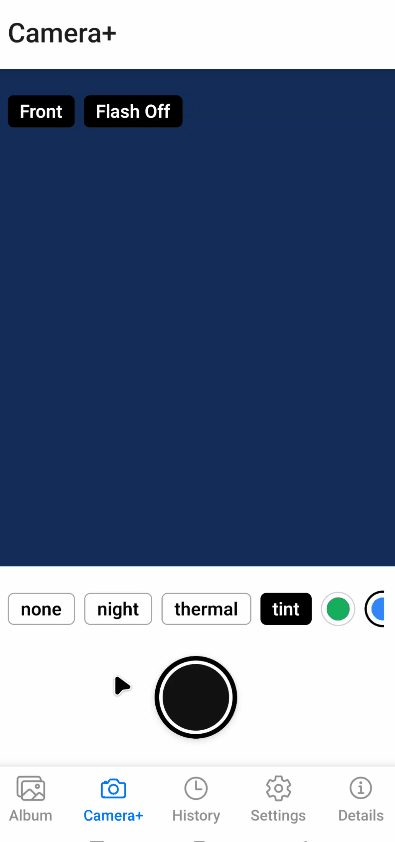
- App is closed and reopened.
- User remains logged in without re-entering credentials.
- Demonstrates secure session persistence behaviour.

### 15. New Registration
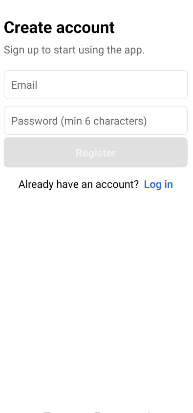
- New user fills out registration fields.
- Form submits and account is created.
- Confirms that first-time users can onboard successfully.

### 16. Error Clearing
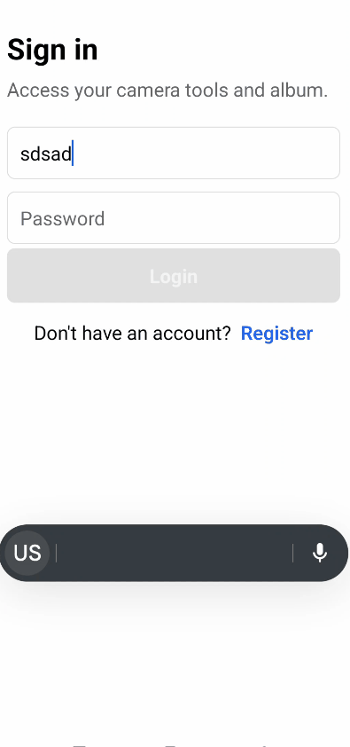
- User corrects invalid input after an error message appears.
- Error messages disappear once the data becomes valid.
- Shows responsive form validation and feedback.

### 17. First-Run Permissions
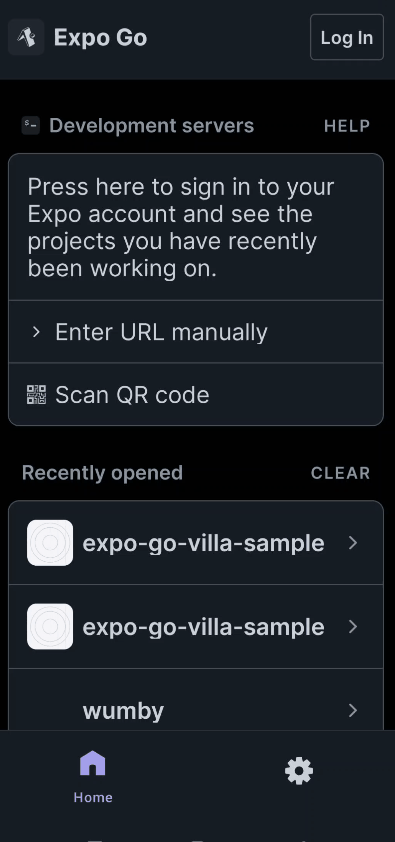
- OS permission dialogs appear on first use (e.g., camera/storage).
- User accepts the required permissions.
- Demonstrates how the app handles mandatory first-run prompts.

### 18. Photo Editing
[Video: Photo Editing](docs/screenshots/Video4.1_PhotoEditing.mp4)
- User opens an image for editing.
- Applies basic edits such as crop, adjustments, or markup.
- Shows the core editing tools in action.

### 19. Export Flow
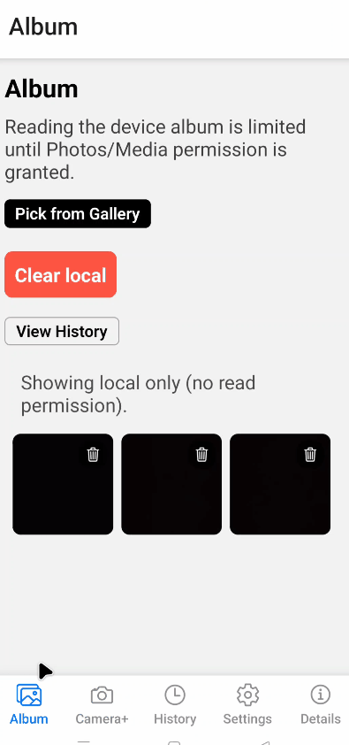
- Edited image is exported from the app.
- User chooses export / save option and completes the flow.
- Demonstrates how work is turned into a final output file.

### 20. Export History Entry

- Newly exported item appears in the history list.
- Confirms that exports are tracked for later review.
- Shows visual feedback after a successful export.

### 21. Export Error Handling
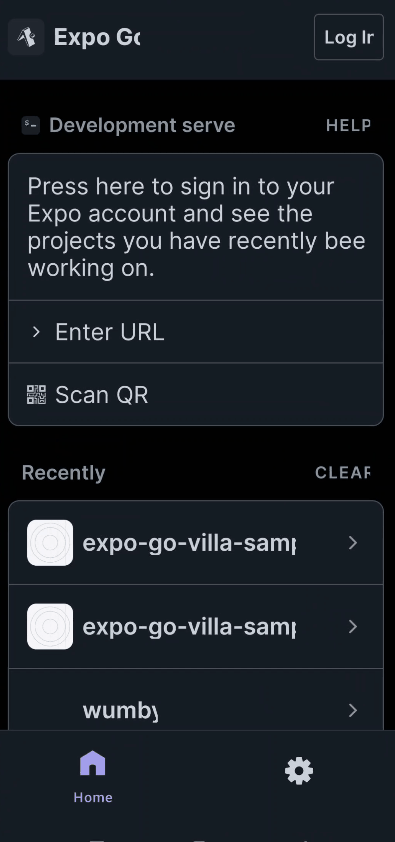
- Export fails due to a missing permission or other issue.
- App displays a clear error message to the user.
- Demonstrates robust error handling for critical actions.

### 22. Re-Editing Exported Item
[Video: Re-Edit Exported](docs/screenshots/Video5.4_ReEditExported.mp4)
- User reopens an already exported image.
- Further edits are applied on top of the exported version.
- Shows support for iterative editing workflows.

### 23. Clear History
[Video: Clear History](docs/screenshots/Video5.6_ClearHistory.mp4)
- User clears the export / history list.
- App confirms removal of old items.
- Demonstrates data-management tools for the user.

### 24. Signing Out
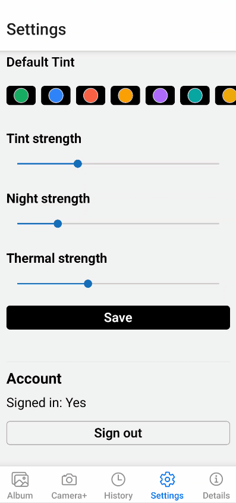
- User navigates to the sign-out option.
- Account session is ended and the app returns to the login screen.
- Confirms that users can safely log out at any time.


## Technical Details

### Image Baking Process
1. Camera captures raw image
2. OffscreenComposer renders image with current effect overlays
3. ViewShot captures the composited result to temporary file
4. File is persisted to Camera directory (writable in Expo Go)
5. Both raw and baked URIs are stored in CameraStore

### State Persistence
- Camera settings (look, tint, strengths) persist via MobX makePersistable
- History entries persist with safeStorage wrapper (suppresses AsyncStorage errors)
- Recent shots limited to 50 items to prevent "Row too big" errors
- History entries limited to 100 items with pagination

### Export Flow
1. Photo Editor captures current view with ViewShot
2. Converts to file URI if needed
3. Uses MediaLibrary.createAssetAsync() to save to gallery
4. Marks history entry as exported with exportedUri
5. Shows success alert

### Permissions Handling
- Camera permission: Required for capture
- Media Library write: Required for export
- Media Library read: Optional; app works without it (shows only local captures)

## Known Limitations (Expo Go)
- Android/Expo Go can deny album read permission; Camera+ falls back to local shots only
- File system access is limited; app uses Camera directory for persistent storage
- AsyncStorage has size limits; app uses safe wrapper and limits stored data
- Large images may cause performance issues; app uses quality settings to balance size/quality

## Project Structure
```
src/
├── app/                    # Expo Router pages
│   ├── (app)/             # Protected routes (require auth)
│   │   ├── camera-advanced.tsx  # Main camera screen
│   │   ├── viewer.tsx           # Photo viewer
│   │   ├── photo.tsx            # Photo editor
│   │   ├── album.tsx            # Gallery/album view
│   │   ├── history.tsx          # Edit history
│   │   ├── settings.tsx          # App settings
│   │   └── details.tsx           # App info
│   ├── login.tsx          # Login screen
│   └── register.tsx       # Registration screen
├── stores/                # MobX stores
│   ├── camera-store.ts    # Camera state & recent shots
│   ├── history-store.ts   # Edit history
│   └── auth-store.tsx     # Authentication
├── components/            # Reusable components
│   └── OffscreenComposer.tsx  # Effect compositing
└── lib/                  # Utilities
    ├── fs.ts             # File system helpers
    ├── safe-storage.ts   # AsyncStorage wrapper
    └── tint.ts           # Color utilities
```


---

# Application Report: Camera+ (Expo Go Villa College Coursework) Photo Editing Camera App

## Table of Contents

1. [Executive Summary](#executive-summary)
2. [Application Overview](#application-overview)
3. [Technology Stack](#technology-stack)
4. [Architecture](#architecture)
5. [Project Structure](#project-structure)
6. [Core Features](#core-features)
7. [State Management](#state-management)
8. [Authentication System](#authentication-system)
9. [Navigation Structure](#navigation-structure)
10. [Screen Details](#screen-details)
11. [Photo Editing Workflow](#photo-editing-workflow)
12. [History System](#history-system)
13. [Permissions Handling](#permissions-handling)
14. [Data Persistence](#data-persistence)
15. [UI/UX Design](#uiux-design)
16. [Development Setup](#development-setup)
17. [Known Limitations](#known-limitations)
18. [Future Enhancements](#future-enhancements)
19. [Assessment Mapping](#assessment-mapping)
20. [Conclusion](#conclusion)
21. [Appendix](#appendix)

## Executive Summary

**Application Name:** Camera+  
**Version:** 1.0.0  
**Platform:** iOS & Android (via Expo Go)  
**Framework:** React Native with Expo SDK 54  
**Primary Purpose:** A photo editing camera application with various tints, history tracking, album viewing and local authentication.
**Coursework Module:** Villa College 2025 Mobile Applications (UFCF7H-15-3_Sep 2025 by Sir Ali Yasir)

This application provides users with a comprehensive photo editing experience, allowing them to:
- Capture photos with real-time visual effects (night vision, thermal, tint overlays)
- Edit photos with customizable effect strengths
- Track editing history with draft and exported states
- Manage a personal album of edited photos
- Secure access through local authentication

| Outcome                        | Where it’s demonstrated in your app                           | Evidence (screen / file / test)                                   |
| ------------------------------ | ------------------------------------------------------------- | ----------------------------------------------------------------- |
| Use of mobile sensors/APIs     | Camera capture, media write, safe permission fallbacks        | Camera+ screen; `camera-permissions.ts`; Test 3.1–3.3 screenshots |
| State management & persistence | MobX stores (auth, camera, history) persisted to AsyncStorage | `src/stores/*`; cold-start auto-login demo                        |
| Navigation & route protection  | Expo Router, protected `(app)` group, hydration check         | `src/app/(app)/_layout.tsx`; sign-out → redirect to `/login`      |
| UX & accessibility basics      | Safe areas, keyboard avoidance, large touch targets           | Login/Register layouts; UI screenshots                            |
| Testing & known limits         | Smoke checklist; Expo Go media-read limitation documented     | Details screen; “Known limitations” section                       |

## Application Overview

### Purpose
A mobile photo editing application designed for coursework that demonstrates:
- React Native and Expo development
- State management with MobX
- Local authentication and data persistence
- Camera and media library integration
- Real-time image processing and effects
- History tracking and management

### Target Users
- Photography enthusiasts
- Users seeking an app with different filters
- Educational purposes

### Key Value Propositions
1. **Real-time Effects:** Apply visual effects while capturing photos
2. **Edit History:** Track all edits with resume and re-edit capabilities
3. **Local Storage:** All data stored locally for privacy
4. **Simple Authentication:** Email/password-based local authentication
5. **Cross-platform:** Works on both iOS and Android via Expo Go

## Technology Stack

### Core Framework
- **React Native:** 0.81.5
- **React:** 19.1.0
- **Expo SDK:** ~54.0.20
- **Expo Router:** ~6.0.10 (File-based routing)

### State Management
- **MobX:** ^6.15.0 (Reactive state management)
- **mobx-react-lite:** ^4.1.1 (React bindings)
- **mobx-persist-store:** ^1.1.8 (AsyncStorage persistence)

### Storage
- **@react-native-async-storage/async-storage:** ^2.2.0 (Local data persistence)

### Camera & Media
- **expo-camera:** ~17.0.9 (Camera access)
- **expo-media-library:** ~18.2.0 (Photo library access)
- **expo-image-picker:** ~17.0.8 (Gallery image selection)
- **react-native-view-shot:** 4.0.3 (Screenshot capture for exports)

### UI Components
- **@expo/vector-icons:** ^15.0.3 (Ionicons)
- **@react-native-community/slider:** 5.0.1 (Range sliders)
- **react-native-safe-area-context:** ~5.6.0 (Safe area handling)
- **react-native-gesture-handler:** ~2.28.0 (Touch gestures)

### Utilities
- **uuid:** ^13.0.0 (Unique ID generation)
- **react-native-get-random-values:** ^2.0.0 (Crypto polyfill)
- **expo-status-bar:** ~3.0.8 (Status bar control)

### Development Tools
- **TypeScript:** ~5.9.2
- **ESLint:** ^9.25.1
- **Prettier:** ^3.2.5

## Architecture

### Album architecture (dual-source)
The album uses a **dual-source** design so users can still see recent photos even when device read permission is unavailable:

- **Primary (device album)**: Reads the `NabhanCamera` album via `expo-media-library` when read permission is granted.
- **Fallback (MobX recent)**: A local, persisted list of the last 50 captures, always available and shown when device album read is blocked.

This ensures graceful degradation on Android/Expo Go where read access is often limited. 

**Capture → Store → Export → Album** (high level flow):  
The app always saves the captured URI into the MobX store, then writes to the gallery on export; album organization is added when read permission allows it. 

### Architecture Pattern
The application follows a **component-based architecture** with:
- **File-based routing** (Expo Router)
- **Centralized state management** (MobX stores)
- **Separation of concerns** (stores, components, utilities)
- **Observer pattern** for reactive UI updates

### Key Architectural Decisions

1. **MobX for State Management**
   - Reactive and observable state
   - Automatic UI updates when state changes
   - Simple API for complex state logic
   - Persistence integration with AsyncStorage

2. **Expo Router for Navigation**
   - File-based routing (similar to Next.js)
   - Type-safe navigation
   - Automatic deep linking support
   - Nested routing with groups

3. **Singleton Store Pattern**
   - Auth store as singleton (no context needed)
   - Direct imports for simplicity
   - Observer components for reactivity

4. **Platform-Aware Permissions**
   - Different permission strategies for iOS/Android
   - Write-only permissions on Android/Expo Go
   - Graceful degradation when permissions denied

## Project Structure

```
RN-ExpoGo-Villa-Sample-ayaan/
├── src/
│   ├── app/                    # Expo Router screens
│   │   ├── _layout.tsx        # Root layout with providers
│   │   ├── login.tsx           # Login screen
│   │   ├── register.tsx       # Registration screen
│   │   └── (app)/              # Protected app group
│   │       ├── _layout.tsx    # Tab navigation layout
│   │       ├── album.tsx      # Photo album screen
│   │       ├── camera-advanced.tsx  # Camera with effects
│   │       ├── photo.tsx      # Photo editor screen
│   │       ├── history.tsx    # Edit history screen
│   │       ├── settings.tsx    # Settings screen
│   │       ├── details.tsx    # App info screen
│   │       └── viewer.tsx     # Viewer (tap from Album; long-press opens Editor)
│   ├── stores/                 # MobX stores
│   │   ├── auth-store.tsx     # Authentication store
│   │   ├── camera-store.ts    # Camera preferences store
│   │   ├── history-store.ts   # Edit history store
│   │   └── index.tsx          # Store provider & exports
│   ├── components/            # Reusable UI components
│   │   ├── ui/                # UI component library
│   │   └── OffscreenComposer.tsx  # Offscreen image compositor for baking effects
│   ├── lib/                   # Utility functions
│   │   ├── camera-permissions.ts  # Permission helpers
│   │   ├── date.ts            # Date formatting
│   │   ├── tint.ts            # Color utilities
│   │   ├── safe-storage.ts    # AsyncStorage wrapper (suppresses "Row too big" errors)
│   │   └── fs.ts              # File system utilities
│   └── translations/          # i18n resources
├── app.json                   # Expo configuration
├── package.json               # Dependencies
└── tsconfig.json              # TypeScript config
```

## Core Features

### 1. Camera with Real-time Effects
- Real-time camera preview with live effect overlays (night, thermal, tint)
- Adjustable effect strength with slider controls
- Circular capture button with haptic feedback

### 2. Photo Editing
- Apply effects to captured or selected photos with real-time preview
- Fine-tune effect intensity and choose tint colors
- Export edited photos to device gallery

### 3. Album Management
- Display device photos and recent captures in merged grid
- Local fallback when read permission unavailable
- Gallery picker and local image deletion

### 4. Edit History
- Track drafts/exported states; filter/sort; resume/re-edit

### 5. Authentication
- Email/password-based local authentication with session persistence
- Protected routes requiring authentication

### 6. Settings
- Camera preferences (default look, tint, effect strengths) and account management

## State Management

### MobX Stores

#### 1. AuthStore (`src/stores/auth-store.tsx`)

**Purpose:** Manages user authentication state and user accounts.

**State Properties:**
- `signedIn: boolean` - Current authentication status
- `email: string | null` - Currently signed-in user's email
- `loading: boolean` - Loading state for async operations
- `error: string | null` - Error message from last operation

**Methods:**
- `init(): Promise<void>` - Initialize store, load session and users
- `register(email, password): Promise<void>` - Register new user
- `login(email, password): Promise<void>` - Sign in existing user
- `logout(): Promise<void>` - Sign out current user
- `isValidEmail(email): boolean` - Validate email format

**Storage:**
- Users map: `auth.users.v1` (AsyncStorage)
- Session: `auth.session.v1` (AsyncStorage)

**Usage:**
```typescript
import { useAuth } from "@/stores/auth-store";
const auth = useAuth();
if (auth.signedIn) { /* user is authenticated */ }
```

#### 2. CameraStore (`src/stores/camera-store.ts`)

**Purpose:** Manages camera preferences and recent photo captures.

**State Properties:**
- `look: Look` - Default effect type ("none" | "night" | "thermal" | "tint")
- `tint: string` - Default tint color (hex)
- `night: number` - Default night effect strength (0-1)
- `thermal: number` - Default thermal effect strength (0-1)
- `tintAlpha: number` - Default tint effect strength (0-1)
- `recent: Shot[]` - Array of recently captured photos

**Methods:**
- `setLook(v: Look)` - Set default effect
- `setTint(v: string)` - Set default tint color
- `setNight(v: number)` - Set night strength
- `setThermal(v: number)` - Set thermal strength
- `setTintAlpha(v: number)` - Set tint strength
- `pushLocal(payload: { uri, bakedUri?, look?, tint?, alpha?, createdAt? })` - Add photo to recent list with metadata
- `removeShot(id: string)` - Remove photo from recent
- `removeLocalByUri(uri: string)` - Remove local image by URI
- `clearShots()` - Clear all recent photos
- `clearLocal()` - Clear all local-only images

**Persistence:** Automatically persisted via `mobx-persist-store` using `safeStorage` wrapper (suppresses "Row too big" errors) to `CameraStore.v1`

#### 3. HistoryStore (`src/stores/history-store.ts`)

**Purpose:** Tracks photo editing history with metadata.

**State Properties:**
- `recentEdits: EditEntry[]` - Array of all edit entries
- `filter: 'all' | 'drafts' | 'exported'` - Current filter
- `sort: 'newest' | 'oldest'` - Current sort order

**EditEntry Type:**
```typescript
type EditEntry = {
  id: string;                    // UUID v4
  sourceUri: string;             // Original image URI
  effect: 'none' | 'night' | 'thermal' | 'tint';
  tintHex?: string;              // Tint color (if effect is 'tint')
  strength: number;              // Effect strength (0-1)
  exportedUri?: string;          // Exported image URI (if exported)
  status: 'draft' | 'exported';  // Current status
  createdAt: number;             // Timestamp
  updatedAt: number;             // Last update timestamp
}
```

**Methods:**
- `addDraft(entryLike): EditEntry` - Create new draft entry (always creates new entry, no de-duplication)
- `updateDraft(id, updates)` - Update existing draft entry with new effect/strength/tint
- `markExported(id, exportedUri)` - Mark entry as exported
- `deleteEdit(id)` - Remove entry by ID
- `clearEdits()` - Clear all entries
- `setFilter(v)` - Set filter type
- `setSort(v)` - Set sort order

**Computed:**
- `filteredSortedEdits: EditEntry[]` - Filtered and sorted entries

**Persistence:** Automatically persisted via `mobx-persist-store` using `safeStorage` wrapper (suppresses "Row too big" errors) to `HistoryStore`

**Note:** De-duplication was removed - each edit creates a new entry, allowing users to have multiple edits of the same image.

## Authentication System

### Overview
The application uses a **local authentication system** with email and password. All user data is stored locally in AsyncStorage (not suitable for production, but appropriate for coursework).

### Implementation Details

#### User Storage
- **Location:** AsyncStorage key `auth.users.v1`
- **Format:** JSON object mapping email (lowercase) to password
  ```json
  {
    "user@example.com": "password123"
  }
  ```

#### Session Storage
- **Location:** AsyncStorage key `auth.session.v1`
- **Format:** JSON object with email
  ```json
  {
    "email": "user@example.com"
  }
  ```

#### Registration Flow
1. User enters email and password (min 6 characters)
2. Email is validated (format check)
3. System checks if email already exists
4. If valid, user is created and auto-logged in
5. Session is saved to AsyncStorage

#### Login Flow
1. User enters email and password
2. System looks up user in AsyncStorage
3. Password is compared (plain text for coursework)
4. If valid, session is created and user is signed in
5. App redirects to Camera+ tab

#### Logout Flow
1. Session is removed from AsyncStorage
2. `signedIn` flag is set to `false`
3. `email` is cleared
4. User is redirected to login screen

#### Route Protection
- All routes in `(app)/` group are protected
- `_layout.tsx` checks `authStore.signedIn`
- If not signed in, redirects to `/login`
- Login and register screens are public

### Security Considerations
- Passwords are hashed (e.g., SHA-256, bcrypt)
- Use secure storage (e.g., Keychain, Keystore)
- Implement token-based authentication
- Add rate limiting and account lockout
- Use HTTPS for any network requests

## Navigation Structure

### Route Groups

#### Public Routes
- `/login` - Login screen
- `/register` - Registration screen
- `/onboarding` - Onboarding (if implemented)

#### Protected Routes (`(app)/` group)
All routes require authentication. Tab navigation:

1. **Album** (`/(app)/album`)
   - View device photos and recent captures
   - Pick photos from gallery
   - Navigate to editor

2. **Camera+** (`/(app)/camera-advanced`)
   - Main camera interface
   - Real-time effects
   - Capture photos
   - Initial route after login

3. **History** (`/(app)/history`)
   - View edit history
   - Filter and sort entries
   - Resume or re-edit photos

4. **Settings** (`/(app)/settings`)
   - Camera preferences
   - Account management
   - Sign out

5. **Details** (`/(app)/details`)
   - App information
   - Version and credits

#### Hidden Routes
- `/(app)/index` - Redirects to camera-advanced
- `/(app)/photo` - Photo editor (modal-like)
- `/(app)/camera-settings` - Merged into settings
- `/(app)/style` - Removed
- `/(app)/process` - Removed

### Navigation Flow


Login/Register
    ↓ (success)
Camera+ (initial tab)
    ↓
Capture → Viewer (baked look applied)
    ├─ Edit → Photo Editor (optional)
    ├─ Export (saves to gallery/album)
    └─ Delete (removes local shot)
[Tabs remain: Album, Camera+, History, Settings, Details]

## Screen Details

### 1. Login Screen (`src/app/login.tsx`)

**Purpose:** Authenticate existing users.

**Features:**
- Email input (auto-capitalize disabled, email keyboard)
- Password input (secure text entry)
- Login button (disabled until valid)
- Error message display
- Link to registration
- Safe area handling
- Keyboard avoidance

**Validation:**
- Email format validation
- Password minimum 6 characters
- Button disabled during loading

**Navigation:**
- Success → `/(app)/camera-advanced`
- Error → Display error message

### 2. Register Screen (`src/app/register.tsx`)

**Purpose:** Create new user accounts.

**Features:**
- Email input
- Password input (min 6 characters)
- Register button
- Error message display
- Link to login
- Same layout as login (SafeArea, KeyboardAvoiding)

**Validation:**
- Email format validation
- Password length validation (≥6)
- Duplicate email check

**Navigation:**
- Success → Auto-login → `/(app)/camera-advanced`
- Error → Display error message

### 3. Camera+ Screen (`src/app/(app)/camera-advanced.tsx`)

**Purpose:** Main camera interface with real-time effects.

**Features:**
- Fixed white app bar with "Camera+" title
- Dark divider strip below app bar
- Front/Flash buttons with icons (Ionicons) positioned below divider, styled as dark pills with white border
- Live camera preview
- Effect selector (None, Night, Thermal, Tint)
- Strength slider (for selected effect)
- Tint color picker (when Tint selected)
- Circular capture button
- Permission handling
- Recent captures display

**Effects:**
- **None:** Original camera view
- **Night:** Green overlay with adjustable strength
- **Thermal:** Red/orange overlay with adjustable strength
- **Tint:** Color overlay with customizable color and strength

**Navigation:**
- Capture → Viewer (baked look)
- Album button → Album screen

### 4. Photo Editor Screen (`src/app/(app)/photo.tsx`)

**Purpose:** Edit photos with effects and export.

**Features:**
- Image preview
- Effect selector
- Strength slider
- Tint color picker
- Export button
- Back button
- Auto-export support (via params)

**Modes:**
- `new` - New edit (creates draft)
- `edit` - Edit existing (updates or creates draft)

**Parameters:**
- `mode: 'new' | 'edit'`
- `sourceUri: string`
- `effect: string`
- `tintHex: string`
- `strength: string`
- `editId?: string` (for resume)
- `autoExport?: 'true'` (auto-export on load)

**Export Flow:**
1. Capture view as image (ViewShot)
2. Request write permission
3. Save to gallery (MediaLibrary.createAssetAsync)
4. If read permission: add to album
5. Update history entry (mark as exported)
6. Show success message

**Navigation:**
- Back → Album screen
- Export → Stay on screen, show success

### 5. Album Screen (`src/app/(app)/album.tsx`)

**Purpose:** Browse device photos and recent captures.

**Features:**
- Device photos grid (when read permission granted)
- Recent captures grid
- Local-only images (fallback)
- "Pick from Gallery" button
- Delete button on local images
- "Clear local" button

**Permission Handling:** See Permissions Handling for platform details.

**Navigation:**
- Pick photo → Create draft → Photo Editor
- Tap image → Viewer; Long-press → Photo Editor (continue manual edits)

### 6. History Screen (`src/app/(app)/history.tsx`)

**Purpose:** View and manage edit history.

**Features:**
- Filter chips (All, Drafts, Exported)
- Sort toggle (Newest/Oldest)
- Scrollable filter row
- **Pagination:** Displays 10 entries per page with Previous/Next navigation and page indicator
- History list with thumbnails
- Entry details (effect, strength, date, URI)
- Status badges (Draft/Exported)
- Action buttons (horizontally scrollable):
  - **Resume** (drafts) - Continue editing
  - **Export** (drafts) - Export draft
  - **Re-edit** (exported) - Create new edit from exported
  - **Delete** - Remove entry
- Clear history button
- Empty state with "Go to Camera+" button

**Entry Display:**
- Thumbnail (exported URI or source URI)
- Effect name with tint info
- Status badge (green for exported, gray for draft)
- Strength percentage
- Formatted date (relative or absolute)
- URI tail (monospace, truncated)

**Navigation:**
- Resume → Photo Editor (with editId)
- Re-edit → Photo Editor (new draft)
- Export → Photo Editor (auto-export)

### 7. Settings Screen (`src/app/(app)/settings.tsx`)

**Purpose:** Configure camera preferences and manage account.

**Features:**
- **Camera Settings:**
  - Default look selector
  - Default tint color picker
  - Tint strength slider
  - Night strength slider
  - Thermal strength slider
  - Save button
- **Account Section:**
  - Sign-in status display
  - Sign out button (if signed in)

**Persistence:**
- Settings saved to AsyncStorage (`STORAGE_CAMERA_PREFS`)
- Loaded on mount

**Navigation:**
- Sign out → Login screen

### 8. Details Screen (`src/app/(app)/details.tsx`)

**Purpose:** Display app information.

**Features:**
- App name
- Version information
- Description
- Credits
- Links to documentation

**Content:**
- Static information about the app
- No dynamic data or history

### 9. Viewer Screen (`src/app/(app)/viewer.tsx`)

**Purpose:** Show the baked capture (look applied by Camera+) without entering the editor.

**Features:**
- Fullscreen preview with Back, Edit, Export, and Delete buttons.

## Photo Editing Workflow

### Workflow Diagram

1. Capture/Select Photo
   ├─ Camera+ → Capture (with baked effect)
   └─ Album → Pick from Gallery
        ↓
2. Bake Effect (Camera+ only)
   └─ ViewShot captures image with applied look
        ↓
3. Navigate to Viewer
   └─ Display baked image with actions
        ↓
4. User Actions (from Viewer)
   ├─ Edit → Photo Editor (apply/adjust effects)
   ├─ Export → Photo Editor (auto-export mode)
   └─ Delete → Remove from local list
        ↓
5. Export Process (if Export chosen)
   ├─ Capture view (ViewShot)
   ├─ Save to gallery
   ├─ Add to album (if permission)
   └─ Mark as exported (HistoryStore.markExported)
        ↓
6. History Entry Updated
   └─ Status: 'draft' → 'exported'
```

### Draft Lifecycle

1. **Creation:** When user picks/captures photo → `addDraft()` creates entry with `status: 'draft'`
2. **Editing:** User can resume editing from History → Opens editor with `editId`
3. **Auto-update:** While editing, `updateDraft()` continuously saves changes to effect, strength, and tint
4. **Export:** When exported → `markExported()` updates entry with `exportedUri` and `status: 'exported'`
5. **Re-edit:** User can create new draft from exported entry (no `editId`)

### Export Process

1. **Capture View:**
   ```typescript
   const uri = await viewRef.current.capture({ format: "jpg", quality: 0.9 });
   ```

2. **Permission Check:**
   ```typescript
   const { canWrite } = await getMediaPermission();
   if (!canWrite) { /* show error */ }
   ```

3. **Save Asset:**
   ```typescript
   const asset = await MediaLibrary.createAssetAsync(uri);
   ```

4. **Add to Album (if read permission):**
   ```typescript
   if (canRead) {
     let album = await MediaLibrary.getAlbumAsync(ALBUM);
     if (!album) {
       album = await MediaLibrary.createAlbumAsync(ALBUM, asset, false);
     } else {
       await MediaLibrary.addAssetsToAlbumAsync([asset], album, false);
     }
   }
   ```

5. **Update History:**
   ```typescript
   if (editId) {
     history.markExported(editId, asset.uri);
   }
   ```

## History System

### Data Model

Each history entry contains:
- **ID:** UUID v4 (unique identifier)
- **Source URI:** Original image location
- **Effect:** Applied effect type
- **Tint Hex:** Color (if tint effect)
- **Strength:** Effect intensity (0-1)
- **Exported URI:** Saved image location (if exported)
- **Status:** Draft or Exported
- **Timestamps:** Created and updated dates

### Filtering

- **All:** Show all entries
- **Drafts:** Only entries with `status: 'draft'`
- **Exported:** Only entries with `status: 'exported'`

### Sorting

- **Newest:** Most recent first (descending by `createdAt`)
- **Oldest:** Oldest first (ascending by `createdAt`)

### Actions

1. **Resume (Draft):**
   - Opens editor with existing `editId`
   - Loads previous effect/strength/color
   - Updates entry on export

2. **Export (Draft):**
   - Opens editor with `autoExport: true`
   - Automatically exports on load

3. **Re-edit (Exported):**
   - Creates new draft entry
   - Uses same source URI and effect settings
   - No `editId` (new entry)

4. **Delete:**
   - Removes entry from history
   - Confirmation alert before deletion

### Pagination

History entries are paginated to improve performance:
- **Items per page:** 10 entries
- **Navigation:** Previous/Next buttons with page indicator (e.g., "Page 1 of 3")
- **Auto-reset:** Page resets to 1 when filter or sort changes

## Permissions Handling

The app uses a platform-aware strategy. iOS grants read+write together; Android on Expo Go often grants write only (read is limited by scoped storage/Photo Picker). We therefore:

Request camera permission on first Camera+ use.

Request media write permission before export.

Only call album read APIs (getAlbumAsync, getAssetsAsync) when canRead === true, otherwise we show the local-recent fallback grid and still allow export (write).
- iOS Strings: NSCameraUsageDescription, NSPhotoLibraryUsageDescription, NSPhotoLibraryAddUsageDescription.
- Android permissions: CAMERA, READ_MEDIA_IMAGES (13+), WRITE_EXTERNAL_STORAGE (legacy/dev build). 


### Camera Permission

**Request:**
```typescript
await Camera.requestCameraPermissionsAsync();
```

**Usage:**
- Required for camera preview and capture
- Requested on app start (in `_layout.tsx`)
- Checked before showing camera

### Media Library Permission

**Platform Differences:**

#### iOS
- Single permission request (`requestPermissionsAsync()`)
- Grants both read and write access
- `canRead === canWrite === granted`

#### Android (Expo Go)
- Write-only permission (`requestPermissionsAsync(true)`)
- Read permissions may not be available in Expo Go
- `canRead === false` (always)
- `canWrite === granted`

**Implementation:**
```typescript
// src/lib/camera-permissions.ts
export async function requestMediaPermission(): Promise<MediaPerm> {
  if (Platform.OS === "ios") {
    const p = await MediaLibrary.requestPermissionsAsync();
    return { canRead: p.granted, canWrite: p.granted };
  }
  // Android: WRITE ONLY
  const p = await MediaLibrary.requestPermissionsAsync(true);
  return { canRead: false, canWrite: !!p.granted };
}
```

**Guarded Operations:**
- **Always allowed:** `createAssetAsync()` (if write permission)
- **Guarded:** `getAlbumAsync()`, `getAssetsAsync()` (only if `canRead === true`)

### Permission Flow

1. **App Start:**
   - Request camera permission
   - Request media write permission
   - Don't request read (may fail on Android/Expo Go)

2. **Export:**
   - Check write permission
   - Save asset (always if write granted)
   - Only manage album if read granted

3. **Album Load:**
   - Check read permission
   - Only load device photos if `canRead === true`
   - Show local fallback if no read permission

### Permission Messages

**iOS (app.json):**
```json
"NSPhotoLibraryUsageDescription": "Allow access to your photo library to select and save images.",
"NSPhotoLibraryAddUsageDescription": "Allow saving edited images to your photo library.",
"NSCameraUsageDescription": "Allow camera access to take photos."
```

**Android (app.json):**
```json
"permissions": [
  "READ_MEDIA_IMAGES",
  "WRITE_EXTERNAL_STORAGE",
  "CAMERA"
]
```

## Data Persistence

### Storage Locations

#### 1. Authentication Data
- **Users:** `auth.users.v1` (AsyncStorage)
- **Session:** `auth.session.v1` (AsyncStorage)

#### 2. Camera Preferences
- **Key:** `camera.prefs.v1` (AsyncStorage)
- **Content:** Default look, tint, effect strengths

#### 3. MobX Persistence
- **CameraStore:** `CameraStore.v1` (via mobx-persist-store with safeStorage)
- **HistoryStore:** `HistoryStore` (via mobx-persist-store with safeStorage)

### Persistence Strategy

#### MobX Persistence
Uses `mobx-persist-store` for automatic persistence with `safeStorage` wrapper:
```typescript
makePersistable(this, {
  name: "StoreName",
  properties: ["property1", "property2"],
  storage: safeStorage, // Wraps AsyncStorage to suppress "Row too big" errors
});
```

**Safe Storage Wrapper:** The `safeStorage` utility (`src/lib/safe-storage.ts`) wraps AsyncStorage calls to suppress "Row too big" errors that can occur when storing large data. It returns `null` for reads and silently fails for writes when these errors occur, preventing app crashes.

**Benefits:**
- Automatic save on state change
- Automatic load on store creation
- Type-safe property selection

#### Manual Persistence
For non-MobX data (camera preferences):
```typescript
await AsyncStorage.setItem(key, JSON.stringify(data));
const data = JSON.parse(await AsyncStorage.getItem(key));
```

### Data Lifecycle

1. **On App Start:**
   - MobX stores auto-hydrate from AsyncStorage
   - Auth store loads session (auto-login if session exists)
   - Camera preferences load from AsyncStorage

2. **On State Change:**
   - MobX stores auto-save (debounced)
   - Manual saves for camera preferences

3. **On Logout:**
   - Session cleared
   - User data remains (for re-login)

4. **On Clear:**
   - History clear removes all entries
   - Local images clear removes recent captures

## UI/UX Design

### Design Principles

1. **Simplicity:** Clean, minimal interface
2. **Accessibility:** Large touch targets, clear labels
3. **Feedback:** Loading states, error messages, success confirmations
4. **Consistency:** Unified button styles, spacing, colors

### Color Scheme

- **Primary:** Dark (#222) for buttons
- **Secondary:** Gray (#666) for text
- **Success:** Green (#10b981) for exported badges
- **Draft:** Gray (#9ca3af) for draft badges
- **Error:** Red (#ef4444) for errors
- **Background:** White (#fff) for screens

### Typography

- **Headings:** 28px, bold (700)
- **Subheadings:** 18px, bold (700)
- **Body:** 16px, regular (400)
- **Small:** 14px, regular (400)
- **Tiny:** 11-12px, monospace for URIs

### Spacing

- **Screen Padding:** 16px
- **Component Gap:** 8-12px
- **Section Margin:** 24px
- **Safe Area:** Handled by SafeAreaView

### Components

#### Buttons
- **Primary:** Dark background, white text
- **Outline:** Border, transparent background
- **Disabled:** Gray, reduced opacity
- **Size Variants:** `sm`, `md`, `lg`

#### Inputs
- **Border:** 1px, #ddd
- **Border Radius:** 8px
- **Padding:** 12px
- **Background:** White

#### Cards
- **Border:** 1px, #e5e7eb
- **Border Radius:** 12px
- **Padding:** 12px
- **Background:** White

### Safe Area Handling

All auth screens use:
```typescript
<SafeAreaView style={{ flex: 1 }}>
  <KeyboardAvoidingView behavior={Platform.OS === "ios" ? "padding" : "height"}>
    <ScrollView contentContainerStyle={{ padding: 16, paddingTop: 32 }}>
      {/* Content */}
    </ScrollView>
  </KeyboardAvoidingView>
</SafeAreaView>
```

### Keyboard Handling

- **KeyboardAvoidingView:** Adjusts layout when keyboard appears
- **ScrollView:** Allows scrolling when content exceeds screen
- **keyboardShouldPersistTaps:** "handled" to allow button presses

### Loading States

- **Button Disabled:** During async operations
- **Loading Text:** "Signing in...", "Creating account...", "Saving..."
- **Spinner:** (If implemented)

### Error Handling

- **Inline Errors:** Red text below inputs
- **Alert Dialogs:** For critical actions (delete, clear)
- **Toast Messages:** (If implemented via FlashMessage)

## Development Setup

### Prerequisites

- Node.js (v18+ recommended)
- npm or yarn
- Expo Go app on iOS/Android device
- Expo CLI (`npm install -g expo-cli`)

### Installation

```bash
# Clone repository
git clone <repository-url>
cd RN-ExpoGo-Villa-Sample-ayaan

# Install dependencies
npm install
# or
yarn install

# Start development server
npx expo start
# or
npm start
```

### Running the App

1. **Start Metro Bundler:**
   ```bash
   npx expo start
   ```

2. **Open in Expo Go:**
   - Scan QR code with Expo Go app (iOS/Android)
   - Or press `i` for iOS simulator, `a` for Android emulator

3. **Clear Cache (if needed):**
   ```bash
   npx expo start -c
   ```

### Development Commands

```bash
# Start development server
npm start

# Run on Android
npm run android

# Run on iOS
npm run ios

# Run on web
npm run web

# Lint code
npm run lint

# Format code
npm run format

# Type check
npx tsc --noEmit
```

### Project Configuration

#### TypeScript
- **Config:** `tsconfig.json`
- **Strict Mode:** Enabled
- **Path Aliases:** `@/` → `src/`

#### ESLint
- **Config:** `eslint.config.js`
- **Rules:** Expo recommended + custom
- **No Duplicate Imports:** Enforced

#### Prettier
- **Config:** `.prettierrc`
- **Plugins:** Tailwind CSS

### Environment Variables

No environment variables required for local development.

### Debugging

- **React Native Debugger:** For React DevTools
- **MobX DevTools:** (If configured)
- **Console Logs:** Available in Metro bundler
- **Expo DevTools:** Built into Expo Go

## Known Limitations

Android/Expo Go album read is limited—see Permissions Handling and the Details screen for platform-specific behavior and mitigation steps.

### 1. Expo Go Constraints

- Android/Expo Go album read access is limited—see Permissions Handling for platform-specific mitigation.

### 2. Authentication

- **Plain Text Passwords:** Not secure for production
  - Solution: Use hashing (SHA-256, bcrypt) in production
- **Local Storage Only:** No cloud sync
  - Solution: Implement backend API for production

### 3. Photo Storage

- **Local Only:** Photos stored on device
  - Solution: Implement cloud storage (Firebase, AWS S3)
- **No Compression:** Large file sizes
  - Solution: Add image compression before export

### 4. History Management

- **No Search:** Can't search by filename or date range
  - Solution: Add search functionality
- **Limited Metadata:** No tags or categories
  - Solution: Add tagging system

### 5. Effects

- **Basic Overlays:** Simple color filters, not advanced processing
  - Solution: Integrate image processing library (e.g., react-native-image-manipulator)

### 6. Performance

- **Large History:** Pagination implemented (10 entries per page) to improve performance
  - Solution: Consider virtualization for very large datasets
- **Image Loading:** No caching strategy
  - Solution: Add image caching (expo-image with cache)

### 7. Error Handling

- **Limited Recovery:** Some errors may require app restart
  - Solution: Add retry mechanisms and better error boundaries

### 8. Accessibility

- **Basic Support:** Not fully accessible
  - Solution: Add accessibility labels, VoiceOver support

## Future Enhancements

### Short-term

1. **Password Hashing:** Implement SHA-256 or bcrypt
2. **Image Compression:** Reduce file sizes before export
3. **Search in History:** Filter by filename or date
4. **Better Error Messages:** More descriptive error handling
5. **Loading Indicators:** Spinners for async operations

### Medium-term

1. **Cloud Sync:** Backend API for user data and photos
2. **Advanced Effects:** More sophisticated image filters
3. **Batch Operations:** Select and export multiple photos
4. **Export Formats:** Support for PNG, WebP
5. **Share Functionality:** Share photos to other apps

### Long-term

1. **User Profiles:** Profile pictures, display names
2. **Social Features:** Share edits with other users
3. **Presets:** Save and reuse effect combinations
4. **Video Support:** Apply effects to video
5. **AI Enhancements:** Auto-enhance, object detection

## Assessment Mapping

| Coursework Criterion | Evidence in App | Where to Verify |
|---|---|---|
| Sensors & Native APIs | Camera capture, baked effects, export to gallery | **Camera+** (`src/app/(app)/camera-advanced.tsx`), **Viewer** (`src/app/(app)/viewer.tsx`) |
| State & Persistence | MobX stores for auth, camera history and settings; AsyncStorage persistence | **Stores** (`src/stores/*`), **Settings** (`src/app/(app)/settings.tsx`) |
| Navigation & Route Protection | Auth-gated tabs, hydration check, redirect to Login when signed out | `src/app/(app)/_layout.tsx`, `src/stores/auth-store.tsx` |
| UX & Accessibility | Safe areas, keyboard avoidance, inline validation, toasts for success/error | **Login/Register** (`src/app/login.tsx`, `src/app/register.tsx`), **Editor/Viewer** |
| Testing & Known Limits | Smoke test checklist; Android/Expo Go album read limitations documented | **Appendix A: Smoke Test Checklist**, **Permissions Handling**, **Details** |

## Conclusion

This application demonstrates a comprehensive photo editing solution built with React Native and Expo. It showcases:

- **Modern React Native Development:** Expo SDK 54, Expo Router, TypeScript
- **State Management:** MobX with persistence
- **Authentication:** Local user management
- **Media Integration:** Camera and photo library access
- **Real-time Effects:** Live preview with overlays
- **History Tracking:** Comprehensive edit history
- **Platform Awareness:** iOS/Android permission handling

## Appendix

### Key Files Reference

- **Auth Store:** `src/stores/auth-store.tsx`
- **Camera Store:** `src/stores/camera-store.ts`
- **History Store:** `src/stores/history-store.ts`
- **Permissions:** `src/lib/camera-permissions.ts`
- **Root Layout:** `src/app/_layout.tsx`
- **App Layout:** `src/app/(app)/_layout.tsx`
- **Camera Screen:** `src/app/(app)/camera-advanced.tsx`
- **Photo Editor:** `src/app/(app)/photo.tsx`
- **Viewer:** `src/app/(app)/viewer.tsx`
- **History:** `src/app/(app)/history.tsx`

### Useful Commands

```bash
# Clear all caches
npx expo start -c

# Reset Metro bundler
rm -rf node_modules/.cache

# Clear AsyncStorage (development)
# Use React Native Debugger or add dev button
```

### Contact & Support

For issues or questions, refer to:
- Expo Documentation: https://docs.expo.dev
- React Native Documentation: https://reactnative.dev
- MobX Documentation: https://mobx.js.org

# Appendix A Smoke Test Checklist

This document provides a step-by-step checklist to verify all critical functionality.

## ✅ Code Verification (Already Complete)

### Route Protection
- ✅ `(app)/_layout.tsx` waits for `authStore.hydrated` before checking `signedIn`
- ✅ Shows loading spinner during hydration
- ✅ Redirects to `/login` when not signed in

### Media Permission Guards
- ✅ `album.tsx` - `getAlbumAsync()` only called when `canRead === true`
- ✅ `photo.tsx` - `getAlbumAsync()` and `addAssetsToAlbumAsync()` only called when `canRead === true`
- ✅ Export always calls `createAssetAsync()` (write permission)
- ✅ No audio permission requests in MediaLibrary calls

### Auth Store
- ✅ `hydrated` flag tracks initialization
- ✅ Session validation on restore
- ✅ Invalid sessions auto-cleared
- ✅ `clearError()` method for proper error handling

### History Features
- ✅ Long-press delete implemented (`onLongPress={() => handleDelete(item.id)}`)
- ✅ Clear history button works
- ✅ Resume restores draft settings
- ✅ Re-edit creates new draft (no `editId` in params)

### Settings & Details
- ✅ Single Settings screen with Camera + Account sections
- ✅ Sign out redirects to login
- ✅ Details page has "Known Expo Go Limitations" section

## Device Testing Checklist

Run these tests on a physical device or emulator:

### 1. Cold Start Gatekeeping

**Test 1.1: Signed Out State**-Needs Video
- [✅] Kill app completely (swipe away from recent apps)
- [✅] Relaunch app
- [✅] **Expected:** Login screen appears
- [✅] **If fails:** Check `authStore.hydrated` and `authStore.signedIn` in `(app)/_layout.tsx`

**Test 1.2: Login Flow**-Needs Video
- [✅] Enter registered email and password
- [✅] Tap "Login"
- [✅] **Expected:** Lands on Camera+ tab (not Album or History)
- [✅] **If fails:** Check navigation in `login.tsx` - should use `router.replace("/(app)/camera-advanced")`

**Test 1.3: Session Persistence**-Needs Video
- [✅] After successful login, kill app completely
- [✅] Relaunch app
- [✅] **Expected:** Still lands on Camera+ (session restored)
- [✅] **If fails:** Check `authStore.init()` in `auth-store.tsx` - should restore session from AsyncStorage

### 2. Registration & Validation

**Test 2.1: New Registration**-Needs Video
- [✅] Go to Register screen
- [✅] Enter unused email (e.g., `test@example.com`)
- [✅] Enter password (6+ characters)
- [✅] Tap "Register"
- [✅] **Expected:** Auto-logs in and lands on Camera+
- [✅] **If fails:** Check `auth.register()` - should set `signedIn = true` and save session

**Test 2.2: Duplicate Email**
- [✅] Try to register with existing email
- [✅] **Expected:** Shows "Email already registered" error
- [✅] **If fails:** Check `auth.register()` - should check users map before creating

**Test 2.3: Email Validation**
- [✅] Enter invalid email (e.g., `notanemail`)
- [✅] **Expected:** Button disabled, or inline error message
- [✅] **If fails:** Check `auth.isValidEmail()` and validation in `register.tsx`

**Test 2.4: Password Validation**
- [✅] Enter password with < 6 characters
- [✅] **Expected:** Red text under input: "Password must be at least 6 characters"
- [✅] **If fails:** Check `register.tsx` - should show validation message

**Test 2.5: Error Clearing**-Needs Video
- [✅] Trigger an error (wrong password, duplicate email)
- [✅] Start typing in email or password field
- [✅] **Expected:** Error message disappears
- [✅] **If fails:** Check `handleEmailChange` and `handlePasswordChange` - should call `auth.clearError()`

### 3. Permissions

**Test 3.1: First Run Permissions**
- [✅] Fresh install or clear app data
- [✅] Launch app and login
- [✅] **Expected:** Camera permission prompt appears
- [✅] **Expected:** Media/Photos permission prompt appears (write-only on Android)
- [✅] **If fails:** Check if permissions are requested in `_layout.tsx` or on first camera/album access


### 4. Editor & Export

**Test 4.1: Photo Editing**-Needs Video
- [✅] Pick photo from gallery or capture new
- [✅] Apply "night" effect
- [✅] Adjust strength slider
- [✅] **Expected:** Preview updates in real-time
- [✅] **If fails:** Check overlay rendering in `photo.tsx`

**Test 4.2: Export Flow**-Needs Video
- [✅] After editing, tap "Export"
- [✅] **Expected:** Button shows "Exporting…" (disabled)
- [X] **Expected:** After completion, shows success toast
- [✅] **Expected:** Button returns to "Export" (not stuck on "Exporting…")
- [✅] **Expected:** Navigates back to Album
- [✅] **If fails:** Check `onExport()` in `photo.tsx` - `finally` block must call `setExporting(false)`

**Test 4.3: Export History Entry**-Needs Video
- [✅] After export, go to History tab
- [✅] **Expected:** Entry appears with "Exported" badge (green)
- [✅] **Expected:** Shows exported image thumbnail
- [✅] **If fails:** Check `history.markExported()` is called in `photo.tsx`

### 5. History UX

**Test 5.1: Filter Chips**
- [✅] Go to History tab
- [✅] **Expected:** Filter chips (All, Drafts, Exported) scroll horizontally
- [✅] **Expected:** "Oldest/Newest" toggle on right doesn't overlap chips
- [✅] **If fails:** Check `history.tsx` - chips should be in horizontal `ScrollView`

**Test 5.2: Drafts Filter**
- [✅] Create a draft (pick photo, don't export)
- [✅] Go to History
- [✅] Tap "Drafts" filter
- [✅] **Expected:** Only shows draft entries
- [✅] **If fails:** Check `history.filteredSortedEdits` computed property

**Test 5.3: Resume Draft**
- [✅] Tap "Resume" on a draft entry
- [✅] **Expected:** Opens editor with previous effect/strength/color
- [✅] **Expected:** Can continue editing
- [✅] **If fails:** Check `handleResume()` - should pass `editId` and all settings

**Test 5.4: Re-edit Exported**-Needs Video
- [✅] Tap "Re-edit" on an exported entry
- [✅] **Expected:** Opens editor with same settings
- [✅] **Expected:** Creates NEW draft entry (check History - should have 2 entries)
- [✅] **If fails:** Check `handleReEdit()` - should NOT pass `editId`, so new draft is created

**Test 5.5: Long-Press Delete**
- [✅] Long-press any history entry
- [✅] **Expected:** Alert appears: "Delete - Remove this history entry?"
- [✅] Tap "Delete"
- [✅] **Expected:** Entry removed from list
- [✅] **If fails:** Check `onLongPress` handler in `history.tsx`

**Test 5.6: Clear History**-Needs Video
- [✅] Scroll to bottom of History
- [✅] Tap "Clear history" button
- [✅] **Expected:** Alert appears: "Clear history - Remove all edited photos from history?"
- [✅] Tap "Clear"
- [✅] **Expected:** All entries removed, shows empty state
- [✅] **If fails:** Check `clear()` function in `history.tsx`

### 6. Settings & Details

**Test 6.1: Settings Screen**
- [✅] Go to Settings tab
- [✅] **Expected:** Shows "Camera Settings" section (default look, tint, strengths)
- [✅] **Expected:** Shows "Account" section below (signed-in status, Sign out button)
- [✅] **Expected:** NO duplicate "Style" or "Account" pages
- [✅] **If fails:** Check `settings.tsx` - should have both sections in one screen

**Test 6.2: Sign Out**-Needs Video
- [✅] In Settings, tap "Sign out"
- [✅] **Expected:** Redirects to Login screen
- [✅] **Expected:** Next navigation attempt shows Login (not Camera+)
- [✅] **If fails:** Check `handleSignOut()` - should call `auth.logout()` and `router.replace("/login")`

**Test 6.3: Details Screen**
- [✅] Go to Details tab
- [✅] Scroll down
- [✅] **Expected:** Shows "Known Expo Go Limitations" section with yellow background
- [✅] **Expected:** Explains Android/Expo Go read permission limitations
- [✅] **If fails:** Check `details.tsx` - should have limitations section

## Common Issues & Fixes

### Issue: App crashes on Album tab
**Fix:** Ensure `getAlbumAsync()` is NEVER called when `canRead === false`. Check `album.tsx` line 33.

### Issue: Export button stuck on "Exporting…"
**Fix:** Ensure `finally` block in `onExport()` always calls `setExporting(false)`. Check `photo.tsx` line 272.

### Issue: App shows wrong screen on launch
**Fix:** Ensure `(app)/_layout.tsx` waits for `authStore.hydrated` before checking `signedIn`. Check line 10-12.

### Issue: History filter chips overlap
**Fix:** Ensure chips are in horizontal `ScrollView` with proper spacing. Check `history.tsx` line 83-111.

### Issue: Password validation doesn't show
**Fix:** Ensure validation message appears when `password.length > 0 && password.length < 6`. Check `register.tsx` line 66-70.

## Final Verification

Ensure:
- [✅] All tests above pass on device
- [✅] No crashes during normal usage
- [✅] No console errors in Metro bundler and hiding any errors that get in the way of user.
- [✅] All screenshots captured (Login, Register, Camera+, Album, Editor, History, Settings, Details)
- [✅] Demo video recorded (2-3 minutes)
- [✅] README updated with test account or "register any email" note


## Package Checklist

- [✅] **Code:** Complete project folder or Expo project
- [✅] **README.md:** Quick start, limitations note, test instructions
- [✅] **APPLICATION_REPORT.md:** Full architecture documentation
- [✅] **Screenshots:** All major screens (8-10 images)
- [✅] **Demo Video:** 2-3 minute walkthrough (Link)

---

**Status:** Ready for device testing. Run the checklist above and mark items as you verify them.

# Appendix B Fixes Applied

This document summarizes all critical fixes applied to make the application ready based on the feedback checklist.

## Critical Fixes Applied

### 1. Route Protection - Enforced with Hydration Check

**File:** `src/app/(app)/_layout.tsx`

**Fix:**
- Added `hydrated` flag to `AuthStore` to track when session loading completes
- Protected tabs now wait for hydration before checking `signedIn` status
- Shows loading spinner during hydration to prevent premature redirects
- Ensures route protection is reliable on app launch

**Code:**
```typescript
if (!authStore.hydrated) {
  return <ActivityIndicator />;
}
if (!authStore.signedIn) {
  return <Redirect href="/login" />;
}
```

### 2. Auth Flow - End-to-End Reliability

**Files:** 
- `src/stores/auth-store.tsx`
- `src/app/login.tsx`
- `src/app/register.tsx`

**Fixes:**
- Added `hydrated` flag to track initialization completion
- Session hydration now validates user still exists before restoring session
- Invalid sessions are automatically cleared
- Password validation message appears under input field (min 6 characters)
- Errors clear when user types (better UX)
- Added `clearError()` method for proper error state management

**Validation:**
- Email format validation with clear error messages
- Password length validation (≥6 characters) with inline feedback
- Duplicate email check on registration
- Wrong password shows clear error message (no silent failure)

### 3. Export Spinner - Never Hangs

**File:** `src/app/(app)/photo.tsx`

**Fixes:**
- Export function wrapped in `try/catch/finally`
- `setExporting(false)` is **always** called in `finally` block (guaranteed)
- Added toast notifications for success/failure using FlashMessage
- Success message includes album name when read permission is available
- Error messages are shown both as toast and alert for visibility

**Code:**
```typescript
try {
  // ... export logic
  showMessage({ message: "Exported successfully", type: "success" });
} catch (e) {
  showMessage({ message: "Export failed", type: "danger" });
  Alert.alert("Export failed", errorMsg);
} finally {
  setExporting(false); // Always executes
}
```

### 4. Photo Editor Back Button

**File:** `src/app/(app)/photo.tsx`

**Status:** ✅ Already correct
- Back button navigates to `/(app)/album` using `router.replace()`
- No dead "index" route navigation

### 5. History Filter Chips - No Overlap

**File:** `src/app/(app)/history.tsx`

**Status:** ✅ Already correct
- Filter chips are wrapped in horizontal `ScrollView`
- Sort toggle is pinned on the right
- Proper spacing prevents overlap

### 6. Safe Areas & Polish

**Files:**
- `src/app/login.tsx`
- `src/app/register.tsx`

**Status:** ✅ Already correct
- Both screens use `SafeAreaView` + `KeyboardAvoidingView`
- Inputs are not under the status bar
- Proper padding and spacing

### 7. Details Screen - Expo Go Limitations

**File:** `src/app/(app)/details.tsx`

**Fix:**
- Added prominent "Known Expo Go Limitations" section
- Explains why album reading may be limited on Android
- Clarifies that exports still work (write permission)
- Notes that full functionality requires development build

## Additional Improvements

### Error Handling
- Errors clear automatically when user types in login/register forms
- Password validation shows inline feedback
- Export errors are shown as both toast and alert

### User Experience
- Loading spinner during auth hydration prevents flash of wrong screen
- Toast notifications provide non-intrusive feedback
- Clear validation messages guide user input

### Code Quality
- Proper MobX actions for state mutations
- Error handling with proper cleanup
- Type-safe navigation


